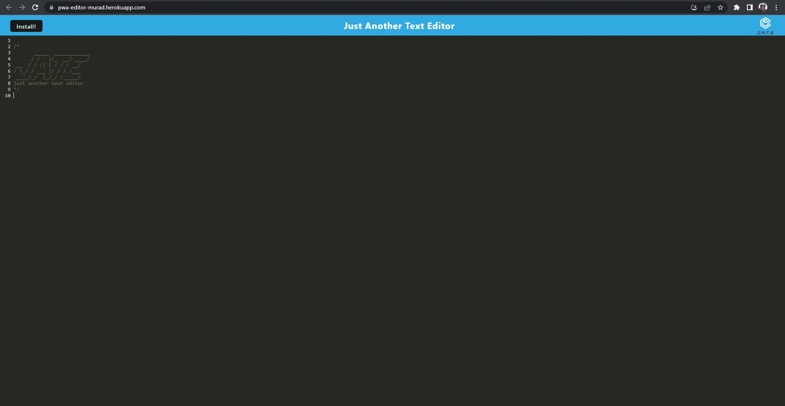

# Progressive Web Application

  

## Description

This is a progressive web application, users can use this to write notes or code snippets with or withour internet connection.

## Heroku Deployment

https://pwa-editor-murad.herokuapp.com/

## Table-of-Contents
* [Installation](#installation)
* [Usage](#usage)
* [URL (github repository)](#urlrepo)
* [License](#license)
* [Questions](#questions)

## Installation  

To install type

    npm install

This will install all the dependency modules.

    npm build

This will build the client package.

## Usage      
    npm start dev

To start the project, type the above command and server will start running.

## URL (github repository)

Following link is to access the code files using github repository.

https://github.com/muradmanni/pwa-editor

## [Screenshot](#screenshot)

## [License](#table-of-contents)
The application is covered under the following license: [MIT](https://choosealicense.com/licenses/mit/)

## [Questions](#table-of-contents)
Feel free to email at murad.manni@gmail.com, if you have any further questions relating to this project.

Checkout more on [Github](https://github.com/muradmanni)
---
© 2022 Murad Ali. All Rights Reserved.
